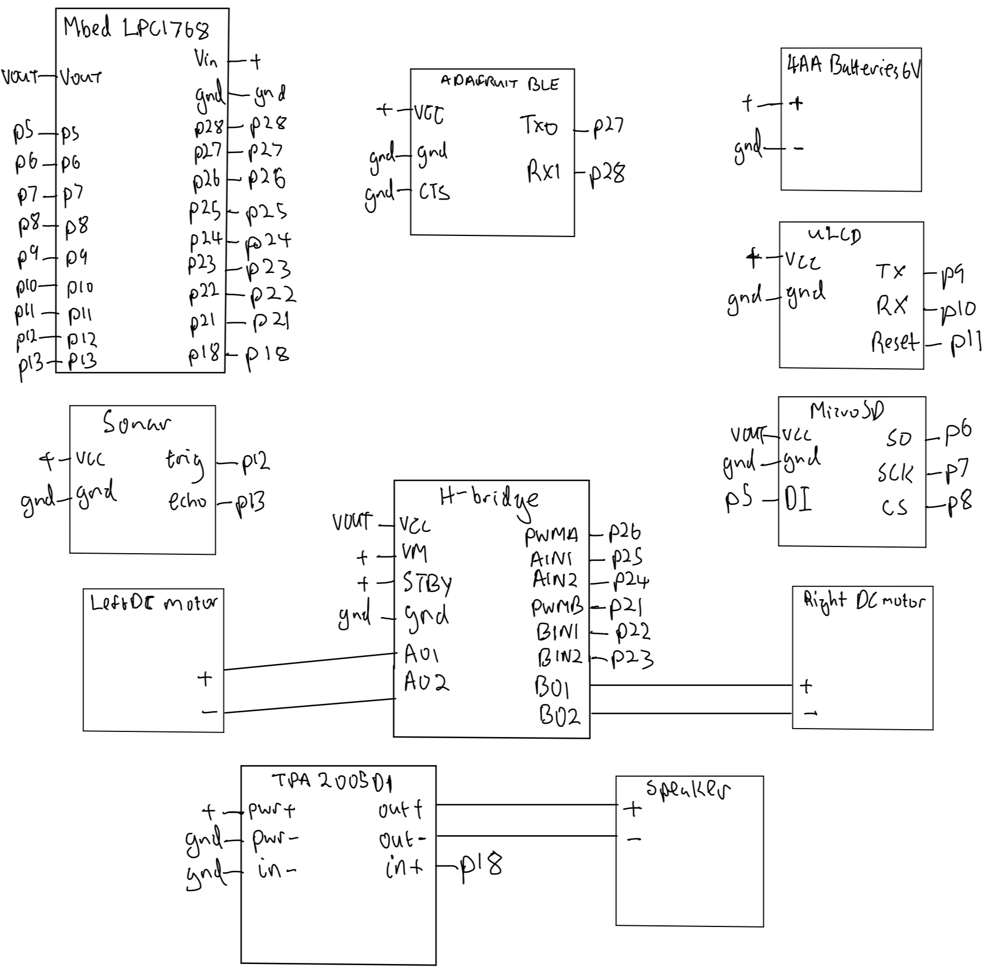

# ECE 4180 Final Project: Hybrid Robo Guide Dog
### By Emmanuel Etukudoh, Tawhid Ahmad, Byron Pritchett

## Description: 
Our goal with this project will be adding aditional functionality to the robot kit available in the lab to make it into a bluetooth controlled guiding robot. We already knew how to interface with the motors of the robot, but for this design project we had to figure out how to add object avoidance, a remote control mode, visual and auditory indicators to the existing robot frame. For object avoidance, we utilized the sonar sensor (HC-SR04) from Lab 3 and fine tuned it to allow for avoidance of a wide variety of objects. When toggled, this modes runs continuously as the robot explores its environment, avoiding objects when they are 250 mm away. We also used the Adafruit Bluetooth LE UART module for the remote control aspect of the robot, as we used the provided controller within the UART app, to manually control the movement of the robot. Both the uLCD and speaker indicate the robot's current mode.

## Equipment:
* mbed
* 4DGL-uLCD-SE
* MicroSD Breakout Board
* Breadboard Mount Speaker
* HC-SR04 Sonar Sensor
* Adafruit Bluetooth LE UART
* ECE 4180 Robot Kit
* DC Motors
* H-bridge
* TI TPA2005D1 class D Audio Amp

## Connections:
| 4AA Batteries 6v | mbed | uLCD | MicroSD | Sonar | Adafruit BLE | H-bridge | Left Motor | Right Motor | TPA2005D1 | Speaker |
| --- | --- | --- | --- | --- | --- | --- | --- | --- | --- | --- |
|+     |Vin     |VCC     |     |VCC     |VCC     |VM, STBY     |     |     |pwr +     |
|-     |gnd     |gnd     |gnd     |gnd     |gnd, CTS     |gnd     |     |     |pwr -, in -     |
|     |VOUT(3.3V)     |     |VCC     |     |     |VCC     |     |     |     |
|     |p5     |     |DI     |     |     |     |     |     |     |
|     |p6     |     |SO     |     |     |     |     |     |     |
|     |p7     |     |SCK     |     |     |     |     |     |     |
|     |p8     |     |CS     |     |     |     |     |     |     |
|     |p9     |TX     |     |     |     |     |     |     |     |
|     |p10     |RX     |     |     |     |     |     |     |     |
|     |p11     |Reset     |     |     |     |     |     |     |     |
|     |p12     |     |     |trig     |     |     |     |     |     |
|     |p13     |     |     |echo     |     |     |     |     |     |
|     |p18     |     |     |     |     |     |     |     |in +     |
|     |p21     |     |     |     |     |PWMB     |     |     |     |
|     |p22     |     |     |     |     |BIN1     |     |     |     |
|     |p23     |     |     |     |     |BIN2     |     |     |     |
|     |p24     |     |     |     |     |AIN2     |     |     |     |
|     |p25     |     |     |     |     |AIN1     |     |     |     |
|     |p26     |     |     |     |     |PWMA     |     |     |     |
|     |p27     |     |     |     |TXO     |     |     |     |     |
|     |p28     |     |     |     |RXI     |     |     |     |     |
|     |     |     |     |     |     |A01     |+     |     |     |
|     |     |     |     |     |     |A02     |-     |     |     |
|     |     |     |     |     |     |B01     |     |+     |     |
|     |     |     |     |     |     |B02     |     |-     |     |
|     |     |     |     |     |     |     |     |     |out +     |+
|     |     |     |     |     |     |     |     |     |out -     |-

## Building Blocks:

## Bluetooth Controller Button Mappings:

## Demo:

## Code:
In order to utilize the code you will have to clone this repositiory into Keil Studio and then compile onto the mbed. 

Steps for cloning:
Keil Studio -> File -> Clone -> Input repository URL 

Once the code is placed into Keil Studio, the project would then be compiled as normal with how projects were compiled in the previous labs. 

## References:
* https://os.mbed.com/users/4180_1/notebook/sparkfun-magician-robot-base-kit/
* https://os.mbed.com/users/4180_1/notebook/using-the-hc-sr04-sonar-sensor/
* https://os.mbed.com/components/Adafruit-Bluefruit-LE-UART-Friend/
* https://os.mbed.com/users/4180_1/notebook/ulcd-144-g2-128-by-128-color-lcd/
* https://os.mbed.com/cookbook/SD-Card-File-System
* https://os.mbed.com/cookbook/Motor
* https://os.mbed.com/users/4180_1/notebook/using-a-speaker-for-audio-output/
